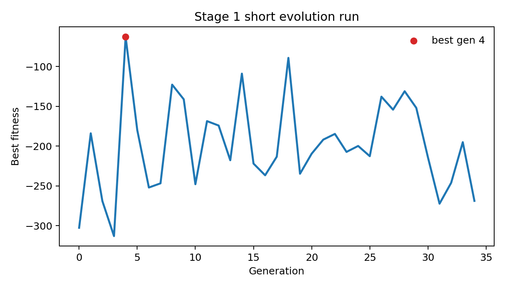
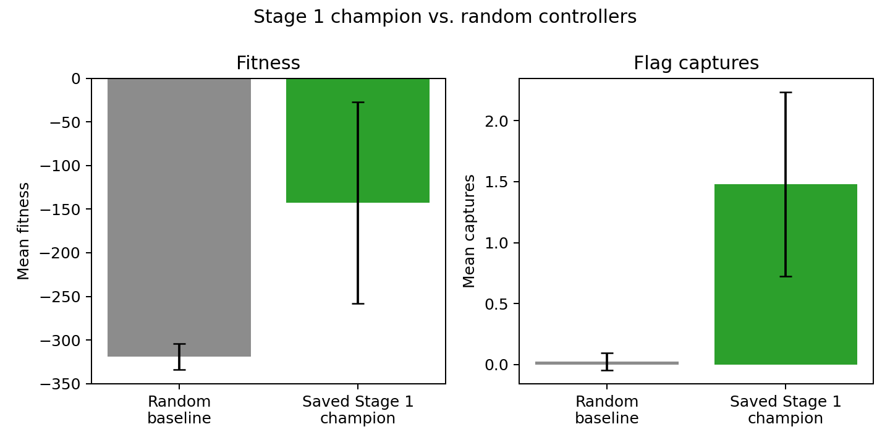
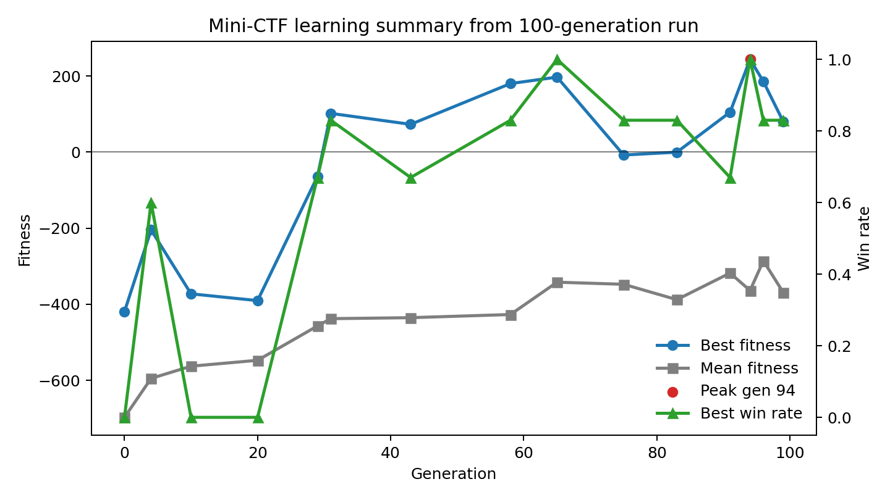

# Evolving a Minimal Neural Agent for Capture-the-Flag

## Introduction

This project asks whether a very small recurrent neural controller can evolve useful behavior in a simplified capture-the-flag environment. Capture-the-flag is a good modeling domain because it requires more than simple movement toward a target. A successful agent must perceive relevant objects, move through space, change behavior depending on context, and respond to another player. Even in a simplified version, the task involves perception, action selection, memory-like dynamics, and adaptation.

The central question is: how much goal-directed behavior can emerge from a minimal neural system? Instead of hand-coding rules like "go to the flag" or "return home when carrying the flag," I use a genetic algorithm to evolve the parameters of a continuous-time recurrent neural network, or CTRNN. The agent receives limited sensory information, updates a tiny neural controller, and produces motor commands. Over many generations, genomes that lead to better behavior are selected and mutated.

The project begins with a Stage 1 toy environment containing one agent, one flag, and one wandering distractor. This stage tests the basic control loop: sensors, neural dynamics, motor outputs, movement, and fitness. I then extend the idea toward a small capture-the-flag environment with two agents, two bases, two flags, carrying, scoring, and tagging.

## Model

The environment is a continuous two-dimensional arena. In the first version, the world contains one evolved agent, one flag, and one wandering distractor. The agent's goal is to reach the flag. The distractor creates an extra object in the environment that the agent can sense but does not need to pursue. This makes Stage 1 a basic test of whether the agent can learn flag-seeking behavior from limited perception.

The extended mini-CTF version adds more game structure. There are two agents, two home bases, and two flags. An agent must reach the opponent's flag, pick it up, return it to its own base, and avoid being tagged while carrying the flag. This makes the task more difficult because the correct behavior depends on the agent's state. When the agent is not carrying a flag, it should move toward the enemy flag. Once it is carrying the flag, it should switch goals and return home.

The agent senses the world through directional ray sensors. In the Stage 1 code, there are four rays arranged around the agent's heading. Each ray has two channels: one for the flag and one for the distractor. This creates eight sensor values total. A ray activates when an object is within its field of view and range. The activation is stronger when the object is closer. This means the agent does not receive a full map of the world. Instead, it gets partial, body-centered information about nearby objects.

The controller is a three-neuron CTRNN. The genome is a flat vector of numbers that encodes the network's recurrent weights, biases, time constants, and sensor weights. During simulation, this genome is unpacked into the matrices and vectors used by the CTRNN. At each timestep, the network receives sensor input, updates its internal neural state, and produces outputs. Two of the outputs control the left and right wheel speeds. This creates differential-drive motion: if both wheels move similarly, the agent moves forward or backward; if one wheel is faster, the agent turns.

The learning method is a genetic algorithm. A population of genomes is evaluated by running episodes in the environment. In Stage 1, fitness rewards the agent for getting closer to the flag and gives a large bonus for capturing it quickly. In the mini-CTF version, fitness rewards progress toward the current task: approaching the enemy flag, picking it up, returning to base, scoring, and tagging the opponent when appropriate. The best genomes are selected, copied, and mutated to form the next generation. Elitism preserves the strongest genomes directly, while tournament selection chooses relatively strong parents without making the process completely deterministic.

**Figure 1.** A short Stage 1 evolution run. Fitness is noisy because each generation is evaluated on sampled episodes, but the run demonstrates the basic evolutionary loop.

## Experiments and Results

I organized the project into two main experiments. The first experiment is the solo flag-capture task. This stage asks whether the basic architecture can learn anything useful at all. If a three-neuron CTRNN cannot learn to approach one flag in a simple arena, then it would be unrealistic to expect it to solve a larger capture-the-flag problem. I measured best fitness, mean fitness, number of captures, and qualitative behavior in replay.

In the solo flag-capture task, the saved Stage 1 champion performed clearly better than random controllers. Across 50 held-out test seeds, the saved champion averaged a fitness of -142.5 and 1.48 captures per episode. For comparison, random genomes averaged about -319.0 fitness and 0.025 captures per episode. This suggests that the evolved controller learned more than random motion: it had a meaningful tendency to approach and capture the flag.

**Figure 2.** Stage 1 champion compared with random controllers. The champion had substantially better fitness and captured the flag more often.

A short reproducible Stage 1 evolution run began with best fitness around -302.5 and reached a peak of about -62.7 by generation 4, although the final generation ended lower at -268.7. This illustrates an important property of evolutionary search: the observed best score can be noisy, especially when agents are evaluated on a limited number of random episodes. In early replays, agents often wandered or turned without a stable relationship to the flag. In better replays, the agent tended to orient toward flag-sensor activations and captured the flag more often than random controllers.

The second experiment is the mini capture-the-flag task. This task tests whether the same minimal controller can support multi-phase behavior. The agent must not only approach a target, but also change its goal after picking up the flag. This is where recurrence may matter. Because the CTRNN has internal state, it may be able to produce behavior that depends partly on recent history rather than only current sensory input.

In the 100-generation mini-CTF run, the agents learned partial but unstable capture-the-flag behavior. The run began with best fitness of -419.2 and mean population fitness of -697.4. For many early generations, the best agent had zero win rate, although there were occasional signs of improvement. Around generation 29, the best agent reached -63.9 fitness with a 0.67 win rate. At generation 31, the best score became positive for the first time, reaching 101.9 with a 0.83 win rate.

The strongest result occurred later in training. Generation 65 reached 197.3 fitness with a 1.00 win rate, and the peak observed score was generation 94 with 243.9 fitness and a 1.00 win rate. The final generation, generation 99, still had a positive best fitness of 79.8 and a 0.83 win rate, but it was not the best genome from the whole run. This distinction matters because evolutionary search can find strong transient solutions and then move away from them. For this reason, the code now saves both the final generation's best genome and the all-time best genome.

**Figure 3.** Selected points from the 100-generation mini-CTF run. The best fitness and win rate improved substantially, but the mean population fitness remained negative.

The mini-CTF result should be interpreted as partial success rather than complete solution. The best agents sometimes achieved high win rates and positive fitness, which suggests that the controller discovered behaviors useful for the task. However, the mean population fitness remained negative even late in training. At generation 99, the mean was still -369.2. This means the genetic algorithm was finding occasional strong agents, not producing a whole population of robust agents. Replay analysis is therefore essential. A high score could mean the agent truly learned to pick up and return the flag, but it could also mean the agent exploited part of the shaped reward, such as approaching the correct object without reliably completing the full capture cycle.

The main observed failure modes were unstable performance across generations, failure to preserve the all-time best behavior, and incomplete multi-phase control. In other words, the architecture appears capable of learning attraction-like behavior and sometimes useful competitive behavior, but it does not yet reliably solve the full capture-the-flag problem. This is still informative because the task was intentionally difficult for a three-neuron controller.

## Discussion

The model shows how simple artificial agents can be used to study embodied cognition. The agent does not have an explicit symbolic plan. It is not told what a flag "means" or given an if-then strategy. Its behavior emerges from the interaction between limited sensors, recurrent neural dynamics, motor outputs, and evolutionary selection. This is the main cognitive modeling idea of the project: adaptive behavior can be produced by a small dynamical system coupled to an environment.

The Stage 1 task tests basic sensorimotor learning. The saved champion's improvement over random controllers shows that a three-neuron CTRNN can evolve simple goal-directed movement. The mini-CTF task is more demanding because it requires different behavior in different states. The 100-generation run shows that the same small controller can sometimes discover useful partial strategies, including high-scoring agents with high win rates. However, the instability of the results suggests that the controller and evolutionary setup are not yet robust enough for reliable full capture-the-flag strategy.

One important lesson from the project is that fitness curves alone are not enough. Evolutionary agents can score well for reasons that are hard to interpret without watching behavior. For example, an agent may receive shaped reward for moving toward a flag even if it never completes the return phase. Replays and qualitative inspection are therefore part of the analysis, not just decoration.

There are several limitations. First, the environment is much simpler than real capture-the-flag. The arena is small, the object types are limited, and the agents do not need long-term planning or communication. Second, the fitness function strongly shapes behavior. Rewards for distance, pickup, scoring, and tagging help guide evolution, but they also mean that the learned behavior is partly determined by the reward design. Third, three neurons may simply be too few for robust capture-the-flag strategy. A useful future experiment would compare three-neuron controllers with larger CTRNNs.

Future work could also improve evaluation. I would use fixed test seeds, compare against random and hand-coded baselines, track the all-time best genome, add curriculum stages, and eventually connect the toy environment to a richer benchmark such as Melting Pot.

## Conclusion

This project tested whether a minimal recurrent neural controller could evolve useful behavior in a simplified capture-the-flag environment. The agent received limited sensory input, updated a three-neuron CTRNN, moved through differential-drive actions, and improved through a genetic algorithm. The Stage 1 task examined basic flag-seeking behavior, while the mini-CTF task tested whether the same architecture could support more context-dependent behavior such as carrying a flag home and responding to an opponent.

The results suggest that the three-neuron CTRNN can learn simple goal-directed behavior and can sometimes produce useful partial capture-the-flag behavior, but it struggles with robust full capture-the-flag strategy. This outcome is informative. It shows that surprisingly small neural systems can generate organized behavior, while also showing where minimal cognition begins to break down. Overall, the project demonstrates how computational modeling can be used to study the relationship between perception, action, internal dynamics, and learning.

## Acknowledgments

This project was developed with iterative coding support from AI tools, including assistance with implementation, documentation, debugging, and result interpretation. The modeling choices, review, and final interpretation remain part of my own project work.
